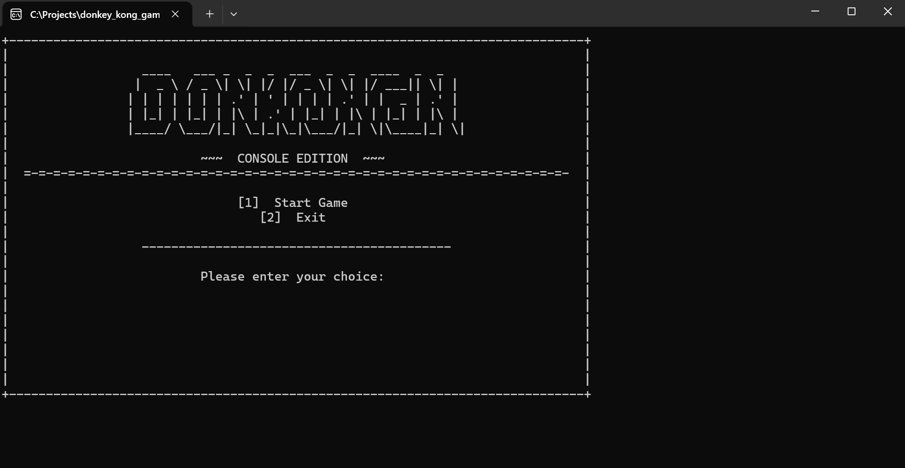
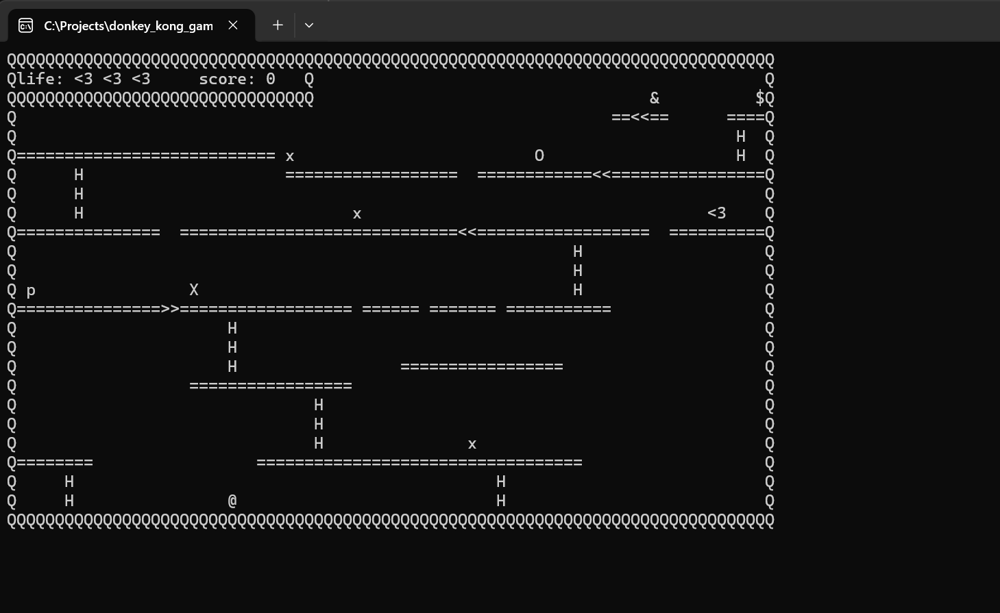
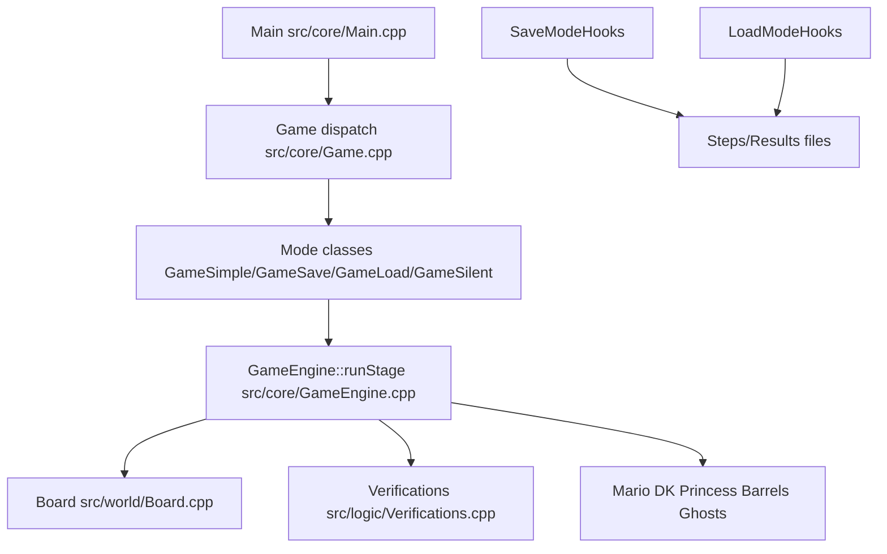

# Donkey Kong — Console Edition

A **C++ terminal clone** of classic Donkey Kong: multi-level ASCII stages, enemies, power-ups, and a data-driven level format you can edit without recompiling.

## Project origin

The game was **first built without Cursor** as a **school project for my degree**: the original C++ implementation, gameplay, and assignment requirements were completed in that academic context.

After that, I **came back to the codebase and upgraded it with Cursor**—refactors (for example engine vs. game modes), tooling, build/repo layout, and quality-of-life fixes happened in this later phase.

**Git-based documentation** (this README, `MEMORY_BANK.md`, `.cursor/rules`, and related project notes) **started when I began that upgrade path**, as I turned the repo into something clearer for collaborators and for my portfolio—not only a coursework submission.

The project still reflects a clean split between **game engine**, **play modes**, and **file-based stages**.

---

## Screenshots

Console captures (Windows terminal). Files live in [`docs/screenshots/`](docs/screenshots/).

<!-- Markdown images so the README renders in GitHub, Cursor, and other Markdown previews -->

*Main menu*

*Gameplay — HUD, platforms, ladders, and entities rendered in the console*

---

## Why this project (for recruiters)

| Area | What it shows |
|------|----------------|
| **C++ & OOP** | Game objects (`Mario`, `DonkeyKong`, barrels, ghosts), shared engine loop, mode-specific behavior behind a small hook interface. |
| **Architecture** | Separation of **core engine** (`GameEngine::runStage`) from **modes** (`GameSimple`, save/load/replay, silent runs) via strategy-style callbacks. |
| **I/O & tooling** | Custom stage format (`.screen`), optional **record/replay** (`.steps` / `.result`), CLI flags for automation and testing. |
| **Real-world constraints** | Stage discovery from the **process working directory**, `assets/` fallback, Visual Studio post-build copy — the kind of “it works on my machine” problems you solve in shipping code. |

---

## Tech stack

- **Language:** C++ (Windows console)
- **Build:** Visual Studio solution (`Donkey_Kong_AN.sln`)
- **Data:** Text stages (`dkong*.screen`) + optional recorded runs

---

## Features

- **ASCII gameplay** with HUD (lives, score), platforms, ladders, ramps, and hazards
- **Difficulty** and **level selection** over discovered stage files
- **Hammer** and **extra-life** mechanics driven by stage data (not hardcoded magic)
- **Save / load / silent** modes for deterministic replays and batch-style runs

---

## Quick start

1. Open **`Donkey_Kong_AN.sln`** in Visual Studio.
2. Build and run the startup project.
3. Stages are discovered from the **runtime working directory** (see below); the debugger is set up so typical runs find `dkong*.screen` next to the built executable.

### Command-line modes

`src/core/Main.cpp` selects behavior from arguments:

| Mode | Args | Purpose |
|------|------|---------|
| Interactive | *(default)* | Normal play |
| Record | `-save` | Write moves/results to `.steps` / `.result` |
| Replay | `-load` | Replay a recorded run |
| Silent replay | `-load -silent` | Replay without console output |

---

## Architecture

The codebase separates a thin **runner/menu** layer from a shared **stage loop** inside the engine; each **mode** plugs in hooks for input, rendering, and recording.

---

## Repository layout (high level)

| Area | Role |
|------|------|
| `src/core/` | Entry, menu, `GameEngine`, mode implementations |
| `src/world/` | `Board::load` — parses `.screen` and places tiles/entities |
| `src/logic/` | Collisions, ladder/hammer/fall/win checks |
| `src/objects/` | Mario, DK, princess, barrels, ghosts |
| `assets/` | Example `dkong*.screen` (and related files) |
| `MEMORY_BANK.md` | **Source of truth** for controls, tile legend, and gameplay invariants |

---

## Stages and file formats

### Stage discovery

Stages are found by scanning the **current working directory** for `dkong*.screen`. If nothing matches, the code can fall back to an adjacent **`assets/`** folder. Related `.steps` / `.result` files follow the same discovery pattern. See `getAllBoardFileNames` / `getAllStepsFileNames` / `getAllResultFileNames` in `src/core/Game.cpp`.

### `.screen` markers (summary)

`Board::load(...)` maps marker characters to entities; notable markers include:

- `@` Mario · `&` Donkey Kong · `$` Princess · `L` legend anchor  
- `x` / `X` ghost spawns · `p` hammer · extra life via `"<3"` pattern  
- `H` ladder · `Q` solid · `=` platform · `<` / `>` ramp indicators  

Full rules live in **`MEMORY_BANK.md`** and `src/world/Board.cpp`.

---

## Controls

- **Move:** `w` `a` `s` `d` — after a direction, Mario **auto-continues** in that direction until you change it.  
- **Ladders:** pressing `s` with **no ladder** under Mario does **not** move him downward (intentional).  
- **Hammer:** `p` when the hammer has been picked up.

---

## Contributing / AI-assisted development

The **Cursor-assisted** work is layered on top of the original degree coursework (see [Project origin](#project-origin)). This repo includes Cursor rules that keep gameplay and parsing changes consistent:

- **`MEMORY_BANK.md`** — invariants (controls, hammer, extra life, `.screen` expectations)  
- **`.cursor/rules/project-context.mdc`** — what to read before gameplay edits  
- **`.cursor/rules/changes-safety.mdc`** — small, reviewable diffs  
- **`.cursor/rules/prompt-tracker.mdc`** — prompt logging for file-changing sessions  

If you change `.screen` parsing or gameplay rules, update **`MEMORY_BANK.md`** in the same change.
